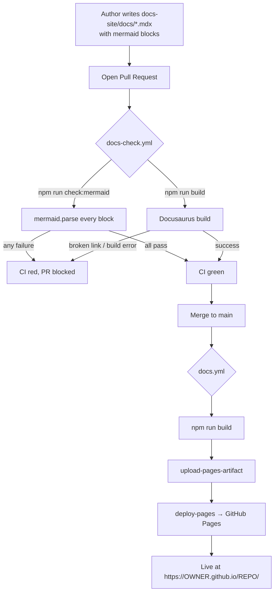
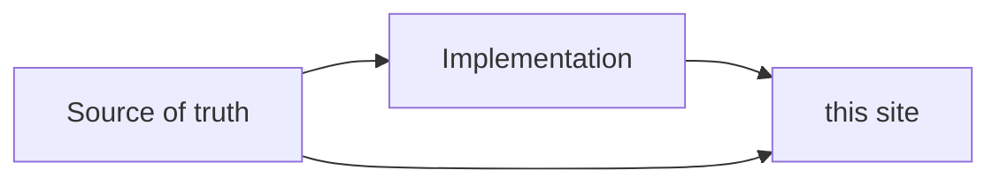

# Portable Docs-Site Setup Guide

This document is a **complete, self-contained recipe** for reproducing the documentation
system that lives in this repository's `docs-site/` folder. It is written so that **a human
or an AI agent can port the entire setup into any other repository — even a completely empty
one — and end up with the same result**:

- A [Docusaurus 3](https://docusaurus.io/) static documentation site.
- Authored in **MDX + Markdown**, with **Mermaid** diagrams that render both on the deployed
  site *and* in GitHub's raw file view.
- A **Mermaid validation** step that parses every diagram in CI so broken diagrams can never
  reach `main`.
- **Auto-deployment to GitHub Pages** via GitHub Actions on every push to `main`.
- A **PR check** that builds the site and validates diagrams on every pull request.

> **How to use this file:** Read the "What you are building" section to understand the shape,
> then either follow the numbered steps by hand or hand the whole file to an AI agent with the
> prompt in the [final section](#appendix-b--ai-agent-prompt). Every file that needs to exist is
> reproduced **in full** below; the only things you change are the placeholders in
> [Section 1](#1-placeholders--fill-these-in-first).

---

## What you are building

```
your-repo/
├── .github/
│   └── workflows/
│       ├── docs.yml          # Build + deploy to GitHub Pages on push to main
│       └── docs-check.yml    # Validate Mermaid + build on every PR
└── docs-site/
    ├── .gitignore
    ├── README.md
    ├── package.json          # Docusaurus 3 + Mermaid theme + jsdom/mermaid for validation
    ├── docusaurus.config.js  # Site config (URL, baseUrl, Mermaid enabled, Prism langs)
    ├── sidebars.js           # Left-nav structure
    ├── scripts/
    │   └── check-mermaid.mjs # Parses every ```mermaid block; fails on syntax errors
    ├── src/
    │   └── css/
    │       └── custom.css    # Theme color overrides
    ├── static/
    │   └── img/
    │       └── favicon.svg
    └── docs/
        └── intro.md          # Landing page (slug: /)
```

The deployed URL follows the GitHub Pages pattern: **`https://<OWNER>.github.io/<REPO>/`**.

### How the pieces fit together



**Why a separate Mermaid check?** Docusaurus renders Mermaid **client-side** in the browser, so
a diagram with a syntax error builds fine and only breaks when a reader loads the page. The
`check:mermaid` script runs every fenced ` ```mermaid ` block through Mermaid's own parser at CI
time (using `jsdom` to fake a browser DOM in Node), so a broken diagram fails the PR instead of
silently shipping.

---

## 1. Placeholders — fill these in first

Every file below uses these placeholders. Decide the values **once**, then substitute them
everywhere they appear. If you are an AI agent, infer them from the target repo's `git remote`
and existing README when possible, and confirm the title/tagline with the user.

| Placeholder      | Meaning                                              | Example              |
|------------------|------------------------------------------------------|----------------------|
| `<OWNER>`        | GitHub user or org that owns the repo (case-sensitive)| `Mihai16`           |
| `<REPO>`         | Repository name                                      | `symphony`           |
| `<TITLE>`        | Human-readable project name shown in the navbar      | `Symphony`           |
| `<TAGLINE>`      | One-line tagline under the title                     | `Manage work, not coding agents.` |
| `<FAVICON_LETTER>` | Single letter for the generated favicon            | `S`                  |

Derived values (computed from the above — do not invent them):

- **Deployed URL:** `https://<OWNER>.github.io/<REPO>/`
- **`url`** in config: `https://<OWNER>.github.io`
- **`baseUrl`** in config: `/<REPO>/`  ← leading **and** trailing slash; this is what makes
  project-pages routing work.

> ⚠️ If you are deploying to a **user/org page** (`<OWNER>.github.io` repo itself) rather than a
> project page, `baseUrl` becomes `/` instead of `/<REPO>/`. The common case (any normal repo) is
> `/<REPO>/`.

---

## 2. Prerequisites

- **Node.js ≥ 18** (CI pins Node 20). Docusaurus 3 requires 18+.
- The target repo is hosted on **GitHub** (the deploy workflow uses GitHub Pages).
- You have permission to enable **GitHub Pages** in the repo settings (Step 6).

No global installs are needed — everything runs through `npm` scripts.

---

## 3. Create the docs-site files

Create the following files exactly. Substitute the placeholders from Section 1 as you go.

### 3.1 `docs-site/package.json`

Pins Docusaurus `3.5.2` and the Mermaid theme. The `devDependencies` (`jsdom`, `mermaid`) exist
**only** to power the validation script — they are not used by the site build itself. The
`webpack` override avoids a transitive-version mismatch.

```json
{
  "name": "<REPO>-docs",
  "version": "0.1.0",
  "private": true,
  "description": "Developer documentation site for <TITLE>.",
  "scripts": {
    "start": "docusaurus start",
    "build": "docusaurus build",
    "serve": "docusaurus serve",
    "clear": "docusaurus clear",
    "typecheck": "tsc --noEmit || true",
    "check:mermaid": "node scripts/check-mermaid.mjs"
  },
  "dependencies": {
    "@docusaurus/core": "3.5.2",
    "@docusaurus/preset-classic": "3.5.2",
    "@docusaurus/theme-mermaid": "3.5.2",
    "@mdx-js/react": "^3.0.0",
    "clsx": "^2.0.0",
    "prism-react-renderer": "^2.3.0",
    "react": "^18.0.0",
    "react-dom": "^18.0.0"
  },
  "devDependencies": {
    "@docusaurus/module-type-aliases": "3.5.2",
    "@docusaurus/types": "3.5.2",
    "jsdom": "^25.0.1",
    "mermaid": "^10.9.1"
  },
  "overrides": {
    "webpack": "5.99.9"
  },
  "browserslist": {
    "production": [">0.5%", "not dead", "not op_mini all"],
    "development": [
      "last 3 chrome version",
      "last 3 firefox version",
      "last 5 safari version"
    ]
  },
  "engines": {
    "node": ">=18.0"
  }
}
```

> The lockfile (`package-lock.json`) is generated by `npm install` — do not write it by hand.
> Commit it after the first install so CI installs are reproducible.

### 3.2 `docs-site/docusaurus.config.js`

This is the heart of the configuration. Key choices:

- `markdown.mermaid: true` + `themes: ['@docusaurus/theme-mermaid']` turn on Mermaid rendering.
- `presets.classic.docs.routeBasePath: '/'` makes docs the site root (no `/docs/` prefix) and
  `blog: false` disables the blog.
- `url` / `baseUrl` / `organizationName` / `projectName` / `deploymentBranch` drive GitHub Pages.
- `onBrokenLinks: 'warn'` keeps builds from failing on a single bad link (tighten to `'throw'`
  if you want stricter CI).
- `prism.additionalLanguages` registers the syntax-highlight grammars you use in code blocks.

```js
// @ts-check
// <TITLE> developer docs — Docusaurus 3 config.
// Mermaid is enabled site-wide via the @docusaurus/theme-mermaid theme.

const { themes } = require('prism-react-renderer');

/** @type {import('@docusaurus/types').Config} */
const config = {
  title: '<TITLE>',
  tagline: '<TAGLINE>',
  favicon: 'img/favicon.svg',

  url: 'https://<OWNER>.github.io',
  baseUrl: '/<REPO>/',

  organizationName: '<OWNER>',
  projectName: '<REPO>',
  deploymentBranch: 'gh-pages',
  trailingSlash: false,

  onBrokenLinks: 'warn',
  onBrokenMarkdownLinks: 'warn',

  i18n: {
    defaultLocale: 'en',
    locales: ['en'],
  },

  markdown: {
    mermaid: true,
  },

  themes: ['@docusaurus/theme-mermaid'],

  presets: [
    [
      'classic',
      /** @type {import('@docusaurus/preset-classic').Options} */
      ({
        docs: {
          routeBasePath: '/',
          sidebarPath: require.resolve('./sidebars.js'),
          editUrl: 'https://github.com/<OWNER>/<REPO>/edit/main/docs-site/',
        },
        blog: false,
        theme: {
          customCss: require.resolve('./src/css/custom.css'),
        },
      }),
    ],
  ],

  themeConfig:
    /** @type {import('@docusaurus/preset-classic').ThemeConfig} */
    ({
      colorMode: {
        defaultMode: 'light',
        respectPrefersColorScheme: true,
      },
      navbar: {
        title: '<TITLE>',
        items: [
          {
            type: 'docSidebar',
            sidebarId: 'mainSidebar',
            position: 'left',
            label: 'Docs',
          },
          {
            href: 'https://github.com/<OWNER>/<REPO>',
            label: 'GitHub',
            position: 'right',
          },
        ],
      },
      footer: {
        style: 'light',
        copyright: `<TITLE> docs.`,
      },
      prism: {
        theme: themes.github,
        darkTheme: themes.dracula,
        additionalLanguages: ['elixir', 'yaml', 'bash'],
      },
      mermaid: {
        theme: { light: 'neutral', dark: 'dark' },
      },
    }),
};

module.exports = config;
```

> **Sidebar id must match.** The navbar item uses `sidebarId: 'mainSidebar'`, which must equal the
> key exported in `sidebars.js` (Section 3.3). If you rename one, rename both.

### 3.3 `docs-site/sidebars.js`

Defines the left-hand navigation tree. The exported key (`mainSidebar`) is referenced by the
navbar config. Each string is a doc **id** (the file path under `docs/` without extension). This
example starts with just the `intro` page; add entries here as you add pages.

```js
// @ts-check
// Sidebar navigation. Add new pages here so they show up in the left nav.

/** @type {import('@docusaurus/plugin-content-docs').SidebarsConfig} */
const sidebars = {
  mainSidebar: [
    'intro',
    // Example of how to add a category with nested pages later:
    // {
    //   type: 'category',
    //   label: 'Architecture',
    //   collapsed: false,
    //   items: [
    //     'architecture/overview',
    //   ],
    // },
  ],
};

module.exports = sidebars;
```

### 3.4 `docs-site/scripts/check-mermaid.mjs`

The validation script. It walks `docs-site/docs/`, extracts every ` ```mermaid ` fenced block,
and runs each through `mermaid.parse()`. `jsdom` provides the browser globals Mermaid expects so
it can run under Node. Exit code is non-zero if any block fails, with the file path and line
number reported.

```js
#!/usr/bin/env node
// Validates every fenced ```mermaid block under docs-site/docs/ by feeding it
// through mermaid.parse(). Docusaurus passes the raw fenced-block content to
// the Mermaid runtime, so we parse the raw text here too — any HTML entities
// like &lt; reach Mermaid's lexer literally and will (correctly) fail.

import { readFileSync } from 'node:fs';
import { readdir } from 'node:fs/promises';
import { extname, relative } from 'node:path';
import { fileURLToPath } from 'node:url';

import { JSDOM } from 'jsdom';

const dom = new JSDOM('<!DOCTYPE html><html><body></body></html>', {
  pretendToBeVisual: true,
});
globalThis.window = dom.window;
globalThis.document = dom.window.document;
globalThis.HTMLElement = dom.window.HTMLElement;
globalThis.Element = dom.window.Element;
globalThis.SVGElement = dom.window.SVGElement;
globalThis.getComputedStyle = dom.window.getComputedStyle;

const { default: mermaid } = await import('mermaid');
mermaid.initialize({ startOnLoad: false });

const DOCS_ROOT = new URL('../docs/', import.meta.url);

async function* walk(dir) {
  const entries = await readdir(dir, { withFileTypes: true });
  for (const entry of entries) {
    const child = new URL(
      entry.name + (entry.isDirectory() ? '/' : ''),
      dir,
    );
    if (entry.isDirectory()) {
      yield* walk(child);
    } else if (['.md', '.mdx'].includes(extname(entry.name))) {
      yield child;
    }
  }
}

function extractMermaidBlocks(text) {
  const lines = text.split(/\r?\n/);
  const blocks = [];
  let inBlock = false;
  let startLine = 0;
  let buffer = [];
  for (let i = 0; i < lines.length; i++) {
    const line = lines[i];
    if (!inBlock && /^```mermaid\b/.test(line)) {
      inBlock = true;
      startLine = i + 1;
      buffer = [];
    } else if (inBlock && /^```\s*$/.test(line)) {
      blocks.push({ content: buffer.join('\n'), line: startLine });
      inBlock = false;
    } else if (inBlock) {
      buffer.push(line);
    }
  }
  return blocks;
}

const cwd = process.cwd();
let checked = 0;
let failed = 0;

for await (const fileUrl of walk(DOCS_ROOT)) {
  const filePath = fileURLToPath(fileUrl);
  const text = readFileSync(filePath, 'utf8');
  const blocks = extractMermaidBlocks(text);
  for (const { content, line } of blocks) {
    checked++;
    try {
      await mermaid.parse(content);
    } catch (err) {
      failed++;
      const rel = relative(cwd, filePath);
      const msg = err && err.message ? err.message : String(err);
      console.error(`\n${rel}:${line} mermaid parse error`);
      console.error(msg.replace(/^/gm, '  '));
    }
  }
}

console.log(`\nChecked ${checked} mermaid block(s).`);
if (failed > 0) {
  console.error(`${failed} block(s) failed validation.`);
  process.exit(1);
}
```

### 3.5 `docs-site/src/css/custom.css`

Theme color overrides. Cosmetic only — change the hex values to match your brand or leave as-is.

```css
/* Minimal overrides on top of Docusaurus defaults. */

:root {
  --ifm-color-primary: #4a3aff;
  --ifm-color-primary-dark: #3324ff;
  --ifm-color-primary-darker: #2417ff;
  --ifm-color-primary-darkest: #1308d6;
  --ifm-color-primary-light: #6151ff;
  --ifm-color-primary-lighter: #6e5fff;
  --ifm-color-primary-lightest: #9387ff;
  --ifm-code-font-size: 92%;
}

[data-theme='dark'] {
  --ifm-color-primary: #9387ff;
  --ifm-color-primary-dark: #7666ff;
  --ifm-color-primary-darker: #6757ff;
  --ifm-color-primary-darkest: #3a25ff;
  --ifm-color-primary-light: #b0a8ff;
  --ifm-color-primary-lighter: #beb7ff;
  --ifm-color-primary-lightest: #e5e1ff;
}
```

### 3.6 `docs-site/static/img/favicon.svg`

A generated single-letter favicon so you don't need a binary asset. Replace `<FAVICON_LETTER>`
with one character.

```svg
<svg xmlns="http://www.w3.org/2000/svg" viewBox="0 0 64 64"><rect width="64" height="64" rx="12" fill="#4a3aff"/><text x="32" y="42" font-family="system-ui,sans-serif" font-size="36" font-weight="700" fill="#fff" text-anchor="middle"><FAVICON_LETTER></text></svg>
```

### 3.7 `docs-site/docs/intro.md`

The landing page. `slug: /` makes it the site root. This is the one page required for the build
to succeed; everything else is additive. Edit the prose for your project — the Mermaid block at
the bottom doubles as a smoke test for both the renderer and the validation script.

````markdown
---
slug: /
sidebar_position: 1
title: Welcome
---

# <TITLE> Developer Docs

Welcome to the developer-facing documentation for <TITLE>. This site explains how the system is
built, how the pieces fit, and why the choices were made the way they were.

## Layout

- **Architecture** — accepted designs, with diagrams. Read these before touching the subsystem
  they describe.
- (More categories will appear here as the docs grow.)

## Conventions

- Pages are Markdown / MDX. Inline diagrams are [Mermaid](https://mermaid.js.org/) fenced blocks;
  they render on the deployed site *and* in GitHub's source view.
- One topic per page. If a page grows past a few thousand words, split it.
- New pages are added by editing `docs-site/sidebars.js`.


````

> ⚠️ **Nested fenced blocks in this guide:** the snippet above contains a ` ```mermaid ` block
> *inside* a Markdown code block. When you create the real `intro.md`, the file should start with
> the `---` front-matter and the inner ` ```mermaid ` block is a normal fenced block — there is no
> outer wrapper. Don't copy the outermost backticks from this guide.

### 3.8 `docs-site/.gitignore`

Keeps build output and dependencies out of git.

```gitignore
# Dependencies
node_modules/

# Production build
build/
.docusaurus/
.cache-loader/

# Local env / logs
.env.local
.env.*.local
npm-debug.log*
yarn-debug.log*
yarn-error.log*
.DS_Store
```

### 3.9 `docs-site/README.md`

Contributor-facing instructions for the docs folder itself.

````markdown
# <TITLE> Developer Docs

Docusaurus site for <TITLE>'s developer-facing documentation: architecture, design notes, ADRs.

The deployed site is at <https://<OWNER>.github.io/<REPO>/>.

## Local preview

```bash
cd docs-site
npm install
npm run start
```

That serves on <http://localhost:3000/<REPO>/> with hot reload.

## Adding a page

1. Create `docs/<area>/<slug>.mdx` (or `.md`).
2. Add the slug to `sidebars.js` under the right category.
3. Use fenced ```mermaid blocks for diagrams — they render both on the deployed site and on
   GitHub when you view the source file.
4. Preview locally before pushing.

## Build

```bash
npm run build
```

Produces a static site under `build/`. CI does this on every push to `main` and deploys to
GitHub Pages via `.github/workflows/docs.yml`.

## Validate Mermaid diagrams

Mermaid blocks are rendered client-side, so syntax errors don't surface during `npm run build`.
A separate check pipes every fenced ```mermaid block under `docs/` through `mermaid.parse()`:

```bash
npm run check:mermaid
```

CI runs the same script on every pull request that touches `docs-site/**` (see
`.github/workflows/docs-check.yml`).

To debug a single diagram by rendering it, drop the block into a `diagram.mmd` file and run
`@mermaid-js/mermaid-cli`:

```bash
npx -p @mermaid-js/mermaid-cli mmdc -i diagram.mmd -o /tmp/out.svg
```
````

---

## 4. Create the GitHub Actions workflows

### 4.1 `.github/workflows/docs.yml` — build & deploy

Triggers on pushes to `main` that touch `docs-site/**` (or the workflow itself), plus manual
`workflow_dispatch`. It builds the site and deploys it to GitHub Pages using the official
first-party Pages actions. The `permissions` and `concurrency` blocks are **required** by
`deploy-pages` — don't drop them.

```yaml
name: Deploy docs site

on:
  push:
    branches: [main]
    paths:
      - 'docs-site/**'
      - '.github/workflows/docs.yml'
  workflow_dispatch:

permissions:
  contents: read
  pages: write
  id-token: write

concurrency:
  group: pages
  cancel-in-progress: false

jobs:
  build:
    runs-on: ubuntu-latest
    defaults:
      run:
        working-directory: docs-site
    steps:
      - uses: actions/checkout@v4

      - uses: actions/setup-node@v4
        with:
          node-version: '20'

      - name: Install
        run: npm install

      - name: Build
        run: npm run build

      - name: Upload artifact
        uses: actions/upload-pages-artifact@v3
        with:
          path: docs-site/build

  deploy:
    needs: build
    runs-on: ubuntu-latest
    environment:
      name: github-pages
      url: ${{ steps.deployment.outputs.page_url }}
    steps:
      - id: deployment
        uses: actions/deploy-pages@v4
```

> **`path: docs-site/build`** is repo-root-relative, even though the build job sets a
> `working-directory` of `docs-site`. `upload-pages-artifact`'s `path` is always relative to the
> repo root — that mismatch is intentional and correct.

### 4.2 `.github/workflows/docs-check.yml` — PR validation

Triggers on pull requests touching `docs-site/**`. Runs the Mermaid validator first (fast fail on
bad diagrams), then a full build (catches broken links and MDX errors). This is the gate that
keeps `main` clean.

```yaml
name: Docs check

on:
  pull_request:
    paths:
      - 'docs-site/**'
      - '.github/workflows/docs-check.yml'

jobs:
  mermaid:
    runs-on: ubuntu-latest
    defaults:
      run:
        working-directory: docs-site
    steps:
      - uses: actions/checkout@v4

      - uses: actions/setup-node@v4
        with:
          node-version: '20'

      - name: Install
        run: npm install

      - name: Validate mermaid diagrams
        run: npm run check:mermaid

      - name: Build docs site
        run: npm run build
```

---

## 5. Install and verify locally

From the repo root:

```bash
cd docs-site
npm install            # generates package-lock.json; commit it afterwards
npm run check:mermaid  # should print "Checked N mermaid block(s)." and exit 0
npm run build          # should produce docs-site/build/ with no errors
npm run start          # optional: live preview at http://localhost:3000/<REPO>/
```

**Success criteria before you commit:**

- `npm run check:mermaid` exits 0 and reports at least the one diagram in `intro.md`.
- `npm run build` completes and creates `docs-site/build/index.html`.
- `npm run start` serves the site and the intro page's diagram renders.

If `npm install` fails on a peer-dependency conflict, the `overrides.webpack` pin in
`package.json` is what resolves the common one; keep it.

---

## 6. Enable GitHub Pages (one-time, in the GitHub UI)

The deploy workflow publishes to Pages, but Pages must be turned on first:

1. Push the branch and merge to `main` (or push these files to `main` directly).
2. In the repo on GitHub: **Settings → Pages**.
3. Under **Build and deployment → Source**, select **GitHub Actions** (NOT "Deploy from a
   branch").
4. Push any change under `docs-site/**` to `main` (or run the **Deploy docs site** workflow
   manually via the Actions tab → *Run workflow*).
5. After the workflow's `deploy` job succeeds, the site is live at
   **`https://<OWNER>.github.io/<REPO>/`**. The URL also appears in the workflow run's
   `github-pages` environment.

> If the deploy job fails with a permissions error, confirm Step 3 is set to **GitHub Actions**
> and that the repo's **Settings → Actions → General → Workflow permissions** allow the workflow
> to run (read/write is fine; the workflow declares its own `permissions:` block regardless).

---

## 7. Authoring conventions (so the AI keeps the docs consistent)

These are the rules the source repo follows. Apply them when generating new pages.

**Page location & naming**

- Pages live under `docs-site/docs/<area>/<slug>.mdx`.
- Slugs are **kebab-case, ≤ 5 words, no version numbers** (versions go in the page body).
- Use `.mdx` by default (enables admonitions, JSX, tabs). Plain `.md` is fine for pure
  prose + Mermaid.

**Front-matter (required on every page)**

```yaml
---
sidebar_position: <N>
title: <Page title>
description: <One-sentence summary that shows up in search snippets.>
---
```

**Body rules**

- Exactly **one H1**, matching `title`. Everything else is `##` or deeper.
- **Diagrams use Mermaid**, fenced as ` ```mermaid `. They render on the deployed site *and* in
  GitHub's raw file view, so the page is useful even without a build. Favorites:
  - `flowchart TD` / `flowchart LR` — module / data-flow.
  - `sequenceDiagram` — lifecycles ("what happens during X").
  - `stateDiagram-v2` — state machines.
- **Code blocks always specify a language.** Languages must be registered in
  `prism.additionalLanguages` (Section 3.2) or be built-in. Add languages there as needed.
- **Admonitions** (`:::note`, `:::caution`, `:::tip`) for callouts — one or two per page max.
- **Link to source code** with absolute `https://github.com/<OWNER>/<REPO>/blob/main/<path>`
  URLs, not repo-relative paths — the deployed site can't resolve `../../` into the repo.
- **Tables** for compact reference (module maps, decision matrices).

**Wiring a new page in**

1. Create the `.mdx`/`.md` file with front-matter.
2. Add its id (path under `docs/`, no extension) to the right category in `sidebars.js`.
3. Run `npm run check:mermaid && npm run build` before committing.

**Mermaid gotcha that the validator catches:** do not HTML-escape characters inside a Mermaid
block (e.g. writing `&lt;` instead of `<`). Docusaurus passes the raw block text to Mermaid, so
escaped entities reach the lexer literally and fail. Write the real characters; if a label needs
special characters, wrap it in quotes per Mermaid syntax.

---

## 8. Porting checklist

```
- [ ] Filled in all placeholders from Section 1 (OWNER, REPO, TITLE, TAGLINE, FAVICON_LETTER)
- [ ] Created docs-site/package.json
- [ ] Created docs-site/docusaurus.config.js (url, baseUrl=/REPO/, org, project correct)
- [ ] Created docs-site/sidebars.js (mainSidebar key matches navbar sidebarId)
- [ ] Created docs-site/scripts/check-mermaid.mjs
- [ ] Created docs-site/src/css/custom.css
- [ ] Created docs-site/static/img/favicon.svg
- [ ] Created docs-site/docs/intro.md (slug: /)
- [ ] Created docs-site/.gitignore
- [ ] Created docs-site/README.md
- [ ] Created .github/workflows/docs.yml
- [ ] Created .github/workflows/docs-check.yml
- [ ] npm install succeeded; committed package-lock.json
- [ ] npm run check:mermaid exits 0
- [ ] npm run build succeeds
- [ ] GitHub Pages source set to "GitHub Actions" in repo Settings
- [ ] Pushed to main; Deploy docs site workflow went green
- [ ] Site live at https://OWNER.github.io/REPO/
```

---

## Appendix A — Version pins reference

| Dependency                      | Version  | Why pinned                                  |
|---------------------------------|----------|---------------------------------------------|
| `@docusaurus/core`              | `3.5.2`  | Docusaurus 3 line; all `@docusaurus/*` match|
| `@docusaurus/preset-classic`    | `3.5.2`  | Must match core                             |
| `@docusaurus/theme-mermaid`     | `3.5.2`  | Mermaid rendering; must match core          |
| `react` / `react-dom`           | `^18`    | Docusaurus 3 requires React 18              |
| `mermaid` (devDep)              | `^10.9.1`| Used by the validation script               |
| `jsdom` (devDep)                | `^25.0.1`| Fake DOM so Mermaid parses under Node        |
| `webpack` (override)            | `5.99.9` | Resolves a transitive version conflict       |
| Node (CI)                       | `20`     | `setup-node` in both workflows               |

Keep all `@docusaurus/*` packages on the **same version**. When upgrading, bump them together and
re-run `npm install && npm run build && npm run check:mermaid`.

---

## Appendix B — AI agent prompt

Paste this to an AI agent (along with this file) to have it build the system in a target repo:

> You are setting up a documentation site in this repository by following `DOCS-SITE-PORTING-GUIDE.md`.
>
> 1. Determine the placeholder values from Section 1: read the `git remote` to get `<OWNER>` and
>    `<REPO>`; read any existing README for the project name and tagline. If `<TITLE>`, `<TAGLINE>`,
>    or `<FAVICON_LETTER>` are unclear, ask me before proceeding.
> 2. Create every file in Sections 3 and 4 exactly as specified, substituting the placeholders.
>    Do not hand-write `package-lock.json`.
> 3. Run `cd docs-site && npm install && npm run check:mermaid && npm run build`. Fix any errors
>    until all three succeed. Commit `package-lock.json`.
> 4. Commit everything on a feature branch with a clear message. Do NOT open a PR or push to a
>    protected branch unless I explicitly ask.
> 5. Tell me the exact manual step I must do in the GitHub UI: Settings → Pages → Source →
>    "GitHub Actions" (Section 6), and the final deployed URL `https://<OWNER>.github.io/<REPO>/`.
> 6. Follow the authoring conventions in Section 7 for any documentation pages you generate.
>
> The repository may be empty except for this guide — that is fine; create the full structure
> from scratch.
