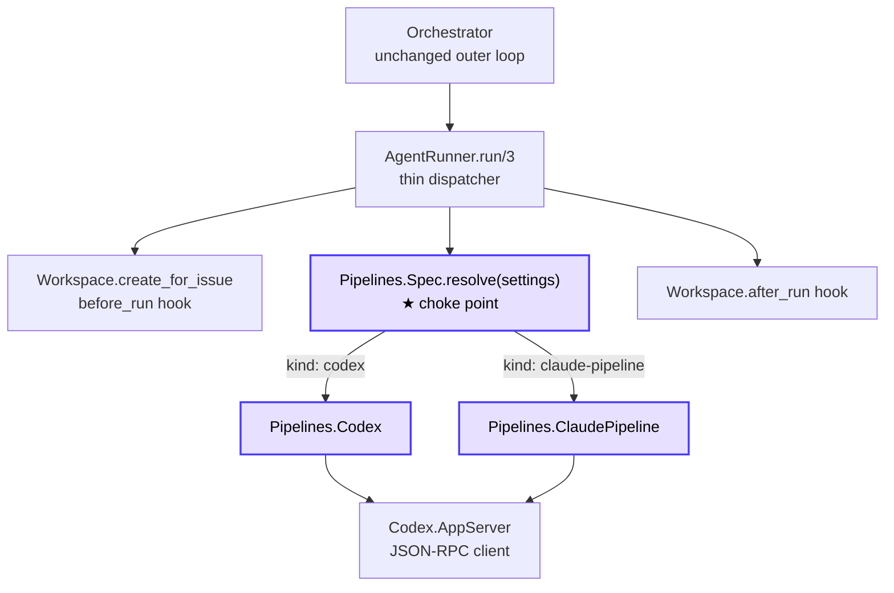
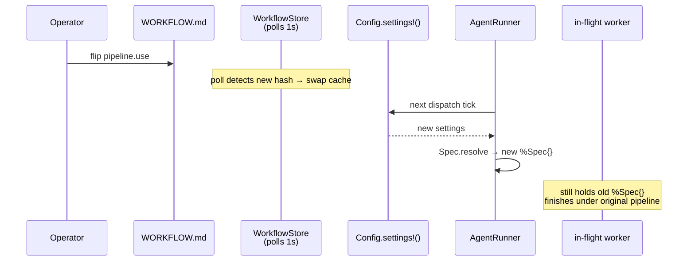

# Pipeline Extension — Architecture

Status: Draft. Companion to the [proposal](https://github.com/Mihai16/symphony/blob/main/proposals/pipeline-extension.md)
(the *contract*) and the [implementation plan](https://github.com/Mihai16/symphony/blob/main/proposals/pipeline-extension-plan.md)
(the *change set*). This page records the architectural decisions that turn the proposal into
buildable code in `elixir/`.

:::note When to read which
- *What* and *why* → the proposal.
- *Change list* → the plan.
- *Shape, seams, rationale* → **this page**.
:::

## 1. Problem Frame

`SymphonyElixir.AgentRunner` currently hardcodes one execution strategy: a Codex app-server
subprocess driven turn-by-turn until `agent.max_turns` or issue completion. Everything else in the
Elixir reference — workspaces, hooks, polling, retries, reconciliation, observability — is generic.

The proposal generalizes the *inner loop* (what happens inside one worker attempt) without touching
the *outer loop* (orchestration, workspace lifecycle, eventing). The architectural question is
therefore narrow: **where does the seam go, and what crosses it.**

Every decision below answers one of those two sub-questions.

## 2. High-Level Architecture



The seam is `Pipelines.Spec` + `Pipelines.Runner`. `Spec` is the read model (one struct that fully
describes the resolved active pipeline). `Runner` is the strategy interface (one function:
`run/4`). `AgentRunner` knows about both; nothing else outside `Pipelines.*` does.

Two crisp invariants:

- **`Pipelines.Spec.resolve/1` is the only function in the system that reads
  `settings.pipeline` or `settings.pipelines`.** Every other call site goes through the resolved
  spec.
- **The spec is resolved once per worker run** (in `AgentRunner.run_on_worker_host/4`) and threaded
  down. In-flight workers therefore complete under the pipeline they were launched with, satisfying
  the proposal's dynamic-reload semantics without any explicit "snapshot config at start" code.

Everything else falls out of those two invariants.

### Lifecycle, in order

```mermaid
sequenceDiagram
  participant O as Orchestrator
  participant AR as AgentRunner
  participant W as Workspace
  participant S as Pipelines.Spec
  participant R as Pipelines.&lt;kind&gt;
  participant AS as Codex.AppServer

  O->>AR: run(issue, recipient, opts)
  AR->>W: create_for_issue
  AR->>W: run_before_run_hook
  AR->>S: resolve(settings)
  S-->>AR: %Spec{name, kind, stall_timeout_ms, ...}
  AR->>O: {:pipeline_runtime_info, issue_id, %{name, kind, stall_timeout_ms}}
  AR->>R: run(spec, workspace, issue, opts)
  R->>AS: start_session(workspace, spec: spec)
  loop per turn, capped by spec.max_internal_iterations + agent.max_turns
    R->>AS: run_turn(session, prompt, issue)
    AS-->>R: {:ok, %{session_id, result}}
    R->>O: {:codex_worker_update, issue_id, %{event, ...}}
  end
  R-->>AR: :ok
  AR->>W: run_after_run_hook
```

## 3. Module Map

### New modules

| Module                                          | File                                                          | Purpose                                                              |
|-------------------------------------------------|---------------------------------------------------------------|----------------------------------------------------------------------|
| `SymphonyElixir.Config.Schema.Pipeline`         | `elixir/lib/symphony_elixir/config/schema.ex`                 | Embed for `pipeline.use` (one field).                                |
| `SymphonyElixir.Config.Schema.PipelineDefinition` | `elixir/lib/symphony_elixir/config/schema.ex`               | Embed for one entry of `pipelines`; union of Codex + Claude fields.  |
| `SymphonyElixir.Pipelines.Spec`                 | `elixir/lib/symphony_elixir/pipelines/spec.ex`                | Resolved-pipeline struct + `resolve/1`. The choke point.             |
| `SymphonyElixir.Pipelines.Runner`               | `elixir/lib/symphony_elixir/pipelines/runner.ex`              | `@callback run/4` behaviour, `module_for_kind/1`.                    |
| `SymphonyElixir.Pipelines.Codex`                | `elixir/lib/symphony_elixir/pipelines/codex.ex`               | Concrete runner; receives the Codex turn loop lifted from `AgentRunner`. |
| `SymphonyElixir.Pipelines.ClaudePipeline`       | `elixir/lib/symphony_elixir/pipelines/claude_pipeline.ex`     | Concrete runner; reuses `Codex.AppServer` with overridden command + timeouts + iteration cap. |

### Modified modules

| Module                                | What changes                                                                                                |
|---------------------------------------|-------------------------------------------------------------------------------------------------------------|
| `SymphonyElixir.Config.Schema`        | Add `pipeline` / `pipelines` embeds; normalize map-shaped YAML into `embeds_many` list; synthesize legacy shim. |
| `SymphonyElixir.Config`               | Extend `validate_semantics/1` to call `Spec.resolve/1`; extend `format_config_error/1` with new clauses.    |
| `SymphonyElixir.AgentRunner`          | Replace `run_codex_turns/5` body with `Spec.resolve → Runner.run`; move Codex-specific helpers to `Pipelines.Codex`. |
| `SymphonyElixir.Codex.AppServer`      | Accept a `:spec` keyword on `start_session/2` and `run_turn/4`; treat global config as fallback.            |
| `SymphonyElixir.Orchestrator`         | New `handle_info({:pipeline_runtime_info, ...})`; stash `stall_timeout_ms_snapshot` on running entry; read it in `reconcile_stalled_running_issues/1`. |
| `SymphonyElixir.Web.Presenter`        | Add `pipeline` and `pipeline_kind` to running-entry / running-issue payloads.                               |

### Unchanged

`WorkflowStore`, `Workspace`, `PromptBuilder`, `Tracker`, `Linear`, `SSH`, `PathSafety`,
`StatusDashboard`. Reload picks up new pipeline selections automatically because consumers route
through `Config.settings!()` → `Workflow.current/0` → `WorkflowStore` on the next tick. No
plumbing needed.

## 4. Architectural Decisions

The proposal leaves several design choices to the implementation. This section commits to each
one. Decisions are reversible; the rationale records what's traded for what.

### ADR-1. Single read model: `Pipelines.Spec` is the only consumer of `settings.pipeline*`

**Decision.** Add one struct, `%Pipelines.Spec{}`, that fully describes the active pipeline at
runtime. `Spec.resolve/1` is the only function permitted to inspect `settings.pipeline` or
`settings.pipelines`. Every other consumer (AgentRunner, Orchestrator stall check, Presenter,
validation) takes a `%Spec{}` or asks the resolver.

**Rationale.** The proposal's selection semantics has three branches: explicit `pipeline.use`,
legacy `codex` shim, and error. If those branches are inlined at each call site, drift is
inevitable — particularly the legacy shim, which is the most invisible of the three. One choke
point fixes that.

**Trade-off.** Adds a thin module. Worth it: cost is zero allocation per dispatch (struct is
reused; reload triggers reconstruction).

### ADR-2. `pipelines` decoded as `embeds_many` with a `:name` field

**Decision.** YAML decodes `pipelines:` as a map (key = pipeline name, value = definition). The
parser normalizes this into an ordered list of `%PipelineDefinition{name: name, ...}` *before*
`changeset/1`. Ordering is by name (sorted, deterministic) so reload diffs are stable.

**Rationale.** Ecto has no first-class "map of embeds keyed by string". `embeds_many` is the
natural fit and ergonomic; the alternative (a single map field with hand-rolled cast) loses
per-field validation and gives worse error messages. Sorting is the cheap way to keep reload
determinism.

**Trade-off.** Lookup by name is `Enum.find/2` (O(n) where n is small; pipelines is a
single-digit list in practice). Fine.

### ADR-3. Behaviour-based runner, not protocol or first-class processes

**Decision.** `Pipelines.Runner` is a `@callback`-style Elixir behaviour. Two compiled-in
implementations. Dispatch is a plain function `module_for_kind/1` returning the module atom;
unknown kinds raise (validation should have caught them upstream).

**Rationale.** Protocols are for polymorphism over data; we have polymorphism over *behaviour*
parameterized by data, which is literally a behaviour. A `GenServer`-per-pipeline-kind would
duplicate the lifecycle work already owned by `AgentRunner.run_on_worker_host/4` for no benefit.

**Trade-off.** No runtime plugin loading. Adding a kind = adding a module + a clause in
`module_for_kind/1` + updating `supported_kinds/0`. Acceptable for v1; the proposal explicitly
disclaims a plugin system as a non-goal.

### ADR-4. `claude-pipeline` reuses `Codex.AppServer`; it is a config adapter, not a new client

**Decision.** Per the proposal, the `claude-pipeline` subprocess speaks the Codex app-server
protocol on stdio. So `Pipelines.ClaudePipeline` does not implement a new client — it calls
`Codex.AppServer.start_session/2` and `run_turn/4` with overrides taken from its
`%PipelineDefinition{}`: `command`, `turn_timeout_ms`, `read_timeout_ms`, `stall_timeout_ms`, and
the iteration cap `min(max_internal_iterations, agent.max_turns)`.

**Rationale.** Two runners that diverge only in *configuration* should not duplicate the
JSON-RPC plumbing. The proposal's "subprocess speaks the Codex protocol" requirement is exactly the
unlock that makes this possible.

**Trade-off.** `Codex.AppServer` must gain an explicit per-call override path. Today it reads
`Config.settings!().codex.X` directly in several places. Those reads become "if `:spec` override
is present use it, else fall back to global config" — small surgical change.

:::caution Naming wart
`Codex.AppServer` is now misnamed (it serves both runners). Renaming is out of scope for the
extension; we accept the wart and document it in the module's `@moduledoc`.
:::

### ADR-5. Resolve the spec once per worker run; snapshot `stall_timeout_ms` on the running entry

**Decision.** `AgentRunner.run_on_worker_host/4` calls `Pipelines.Spec.resolve/1` exactly once,
immediately after the `before_run` hook, before invoking the runner. The resolved `%Spec{}` is
passed down to the runner. Concurrently, `AgentRunner` sends
`{:pipeline_runtime_info, issue_id, %{pipeline: name, kind: kind, stall_timeout_ms: ms}}` to the
Orchestrator, which stashes those fields on the running entry.

`Orchestrator.reconcile_stalled_running_issues/1` reads
`running_entry.stall_timeout_ms_snapshot` (falling back to `Config.settings!().codex.stall_timeout_ms`
for entries that predate this change), not the live spec.

**Rationale.** The proposal mandates that in-flight workers finish under the pipeline they were
launched with. Resolving once gives that property for free. Storing `stall_timeout_ms` on the
running entry extends the same property to the reconcile loop — otherwise flipping `pipeline.use`
mid-run would change the stall threshold under the in-flight worker, which is exactly the failure
mode the proposal forbids.

### ADR-6. Defer per-stage prompt overrides; standardize stage names *loosely*

**Decision.** v1 reserves `implement`, `refine`, `review`, `document`, `test` as stage names with
documented semantics in `ClaudePipeline`. Other names are passed through to the subprocess
uninterpreted. No `prompt:` field per stage.

**Rationale.** Resolves two of the proposal's open questions. The permissive form is purely
additive — we can lock down names or add overrides in v2 without breaking v1 files.

### ADR-7. `max_internal_iterations` stays top-level (no `loop:` block)

**Decision.** Field lives directly under the pipeline definition; not nested under `loop:`.

**Rationale.** YAGNI today. Nesting is a non-additive change later only if a non-iterative
pipeline appears that wants to share stages.

### ADR-8. Track `iteration` in snapshot iff the pipeline emits the events

**Decision.** `running_entry.iteration` is an OPTIONAL integer, populated from the most recent
observed `iteration_started` / `iteration_completed` `notification` event. Absent for
`kind: codex` and for `claude-pipeline` runs that don't emit those events.

**Rationale.** Zero-cost for pipelines that don't participate; useful for those that do.
Additive in the snapshot API.

### ADR-9. No plugin registry; compile-time kind table

**Decision.** `Pipelines.Runner.supported_kinds/0` returns the hard-coded list
`["codex", "claude-pipeline"]`. Adding a kind requires a module + a list entry.

**Rationale.** v1 has two kinds. A plugin system is a separate feature with its own discovery,
versioning, and trust story. Premature.

### ADR-10. SPEC.md edits land *with the code that enforces them*, not ahead

**Decision.** Each `SPEC.md` section addition lands in the PR that introduces the corresponding
behaviour, not earlier.

**Rationale.** Spec-first invites drift if the code doesn't match. Phase 1 ships data-model only;
its SPEC additions are the schema entries. Phase 2 ships dispatch; its SPEC additions are the
Agent Runner §10 changes. Etc.

## 5. Schema Changes

### `WORKFLOW.md` front matter

Two new top-level keys. Existing `codex:` block is preserved as a backwards-compat shim.

```yaml
pipeline:
  use: <name>                  # references a key in `pipelines:`

pipelines:
  <name>:
    kind: codex | claude-pipeline | <impl-specific>
    command: <shell command>
    # kind=codex knobs (mirror legacy `codex:` block)
    approval_policy: ...
    thread_sandbox: ...
    turn_sandbox_policy: ...
    turn_timeout_ms: 3600000
    read_timeout_ms: 5000
    stall_timeout_ms: 300000
    # kind=claude-pipeline knobs
    stages: [implement, review]
    max_internal_iterations: 5
    review_threshold: 8
```

### `Config.Schema` (Elixir)

```elixir
embeds_one(:pipeline, Pipeline, on_replace: :update, defaults_to_struct: true)
embeds_many(:pipelines, PipelineDefinition, on_replace: :delete)
```

`PipelineDefinition` is a *union* schema — it carries fields for every kind. Per-kind
required-field validation runs in its `changeset/2` based on the value of `kind`. The alternative
(one embed module per kind, dispatched by kind discriminator) is heavier ceremony than is warranted
for two kinds, and forces a polymorphic embed pattern Ecto does not natively support.

### Backwards-compat shim

`Schema.parse/1` gains a normalization step *before* `changeset/1`:

1. If `pipelines` is a map (YAML default), convert to a list with `:name` set on each definition,
   sorted by name.
2. If neither `pipeline` nor `pipelines` is present *and* a legacy `codex:` block is present,
   synthesize a single-element `pipelines` list named `__default_codex` (derived from the legacy
   block) and set `pipeline.use = "__default_codex"`.

After normalization, downstream code never has to special-case the legacy path.

## 6. Runtime Contract

### `Pipelines.Spec`

```elixir
%SymphonyElixir.Pipelines.Spec{
  name: String.t(),                       # "__default_codex" for the shim
  kind: String.t(),                       # "codex" | "claude-pipeline"
  command: String.t(),
  # Codex-shared
  approval_policy: String.t() | map() | nil,
  thread_sandbox: String.t() | nil,
  turn_sandbox_policy: map() | nil,
  turn_timeout_ms: pos_integer(),
  read_timeout_ms: pos_integer(),
  stall_timeout_ms: non_neg_integer(),
  # claude-pipeline-only
  stages: [String.t()],
  max_internal_iterations: pos_integer() | nil,
  review_threshold: float() | nil
}

@spec resolve(Config.Schema.t()) :: {:ok, Spec.t()} | {:error, term()}
```

Errors returned: `{:pipeline_unresolved, :missing}`,
`{:pipeline_unresolved, {:unknown_name, name}}`, `{:unsupported_pipeline_kind, kind}`,
`{:missing_pipeline_field, name, field}`.

### `Pipelines.Runner` behaviour

```elixir
@callback run(
  spec :: Pipelines.Spec.t(),
  workspace :: Path.t(),
  issue :: map(),
  opts :: keyword()
) :: :ok | {:error, term()}
```

`opts` carries: `:codex_update_recipient`, `:worker_host`, `:max_turns`, `:issue_state_fetcher`.
Each runner implementation is responsible for emitting `:codex_worker_update` messages and for
honouring `:max_turns`. Lifecycle (workspace, hooks, host selection) is **not** part of the
behaviour — that lives in `AgentRunner` and applies to every kind.

### `Codex.AppServer` overrides

`start_session/2` and `run_turn/4` gain a single `:spec` keyword (a `%Pipelines.Spec{}`). When
present, it takes precedence over `Config.settings!().codex.X` at four current read sites:

- `args: [~c"-lc", spec.command]`
- remote launch command
- `turn_timeout_ms`
- `read_timeout_ms`

`session_policies/2` is extended to derive `approval_policy`, `thread_sandbox`, and
`turn_sandbox_policy` from the spec rather than from `Config.codex_runtime_settings/2` when a spec
is provided.

## 7. Reload Semantics



The proposal's reload contract falls out of three properties already present, plus one new one:

1. **`WorkflowStore` polls every 1 s and atomically swaps the cached workflow.** Already present.
2. **`Config.settings!()` always reads from the store.** Already present.
3. **`Pipelines.Spec.resolve/1` is called fresh on every dispatch decision.** Achieved by calling
   it inside `AgentRunner.run_on_worker_host/4`.
4. **The resolved spec is threaded down the worker call stack, not re-fetched.** New, via the
   `%Spec{}` parameter on `Runner.run/4`. This is what gives "in-flight workers finish under their
   original pipeline" for free.

Operator-visible reload events SHOULD be logged: a single `Logger.info` line when the resolved
`(name, kind)` tuple differs between two consecutive ticks.

Invalid reload (e.g. `pipeline.use` flipped to a missing name) keeps the *last known good*
pipeline because `Config.validate!/0` runs at the top of `Orchestrator.maybe_dispatch/1`, and a
validation failure short-circuits dispatch while leaving running workers and the retry queue
intact.

## 8. Snapshot / Presenter

Additive fields on the running-entry payload:

```json
{
  "issue_id": "MT-649",
  "identifier": "MT-649",
  "pipeline": "claude-implement-document-review",
  "pipeline_kind": "claude-pipeline",
  "iteration": 2,
  "stall_timeout_ms_snapshot": 600000,
  "session_id": "thread-1-turn-1"
}
```

Presenter mirrors the additions on `running_entry_payload/1` and `running_issue_payload/1`. The
retrying-entries payload is unchanged.

## 9. Test Strategy

New test modules:

- `elixir/test/symphony_elixir/pipelines/spec_test.exs` — `resolve/1` over the three selection
  branches, including the legacy shim path. Shim equivalence: any workflow with only a `codex:`
  block resolves to a spec that exactly mirrors that block's fields.
- `elixir/test/symphony_elixir/pipelines/codex_test.exs` — turn loop, prompt construction,
  max-turns capping. Lifted from `app_server_test.exs` where relevant.
- `elixir/test/symphony_elixir/pipelines/claude_pipeline_test.exs` — uses a stub subprocess under
  `test/support/` that speaks just enough of the Codex JSON-RPC protocol to drive a turn to
  completion. Verifies command override, `max_internal_iterations` capping, stage-boundary
  `notification` forwarding, and `iteration` snapshot field population.
- `elixir/test/symphony_elixir/workspace_and_config_test.exs` — the six validation cases from the
  proposal's test matrix.

A targeted regression test for ADR-5: launch a worker, mutate `pipeline.use` mid-run, verify the
running entry's `stall_timeout_ms_snapshot` is unchanged.

## 10. Phasing

| Phase | Scope                                                       | Behaviour change?                              | Mandatory? |
|-------|-------------------------------------------------------------|------------------------------------------------|------------|
| 1     | Schema + `Spec` + validation                                | None (data model only)                        | Yes        |
| 2     | `Runner` behaviour + lift Codex; snapshot/presenter fields  | Snapshot gains `pipeline`/`pipeline_kind`     | Yes        |
| 3     | `ClaudePipeline` runner                                     | New kind supported                            | Optional   |
| 4     | Dynamic reload + validation hardening + reload log line     | Reload behaviour explicit                     | Optional   |

Phases 1–2 are the mandatory floor for shipping multi-pipeline support. Phases 3–4 can ship
independently and in any order relative to each other.

## 11. Risks and Mitigations

- **Two reads of the same data.** Legacy `codex:` block is parseable both directly and via the
  `__default_codex` shim. *Mitigation:* `Spec.resolve/1` is the only allowed reader at production
  call sites; direct reads of `settings.codex.X` survive only in token-totals / telemetry code
  that is kind-agnostic and migrates in Phase 2.
- **`stall_timeout_ms` too aggressive for stage gaps.** A `claude-pipeline` that goes silent
  between stages without emitting `notification` events will be killed by the reconcile loop.
  *Mitigation:* document the requirement in `Pipelines.ClaudePipeline`'s `@moduledoc`; emit a
  `Logger.warning` if no event has been observed within `stall_timeout_ms / 2`.
- **Union embed validation is permissive.** A `kind: codex` definition with a stray `stages:`
  field will parse without error. *Mitigation:* per-kind changeset validation rejects unknown
  fields when the kind is known. Fail loud at parse time, not at dispatch time.
- **Reload determinism with `embeds_many`.** YAML maps have no order; Elixir maps preserve
  insertion order but Ecto compares structurally. *Mitigation:* sort by name in the parser
  normalizer. Two reloads of the same file produce the same struct.

## 12. Out of Scope

- A universal pipeline protocol. Each kind keeps its own contract; only the outer Symphony surface
  (workspace, hooks, events) is shared.
- Replacing `Codex.AppServer` with a generic stdio JSON-RPC client.
- Multi-process pipelines (one Symphony worker → N OS subprocesses).
- Runtime plugin loading for pipeline kinds.
- Per-stage prompt overrides (ADR-6 defers).
- Renaming `Codex.AppServer` to a kind-neutral name.

## 13. Open Follow-ups (Post-v1)

- Decide whether `running_entry.retry_attempts` should carry a `pipeline` field.
- Decide whether to expose `iteration` in the dashboard's hot row UI.
- Consider extracting a shared `do_turn_loop` helper between `Pipelines.Codex` and
  `Pipelines.ClaudePipeline` once a third kind appears (rule-of-three).
- Revisit `Codex.AppServer` naming once a non-Codex-protocol kind lands.
