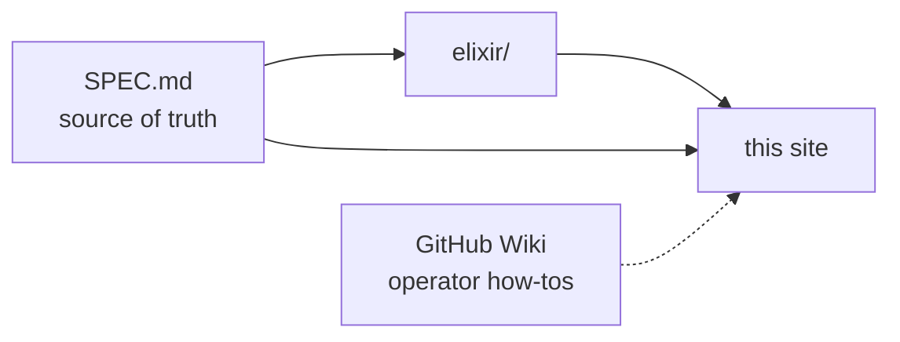

# Symphony Developer Docs

Symphony turns project work into isolated, autonomous implementation runs. This site is the
developer-facing handbook: how the system is built, how the pieces fit, and why the choices were
made the way they were.

If you're an **operator** looking for how-tos (workflow.md changes, SSH workers, dashboard setup),
the [GitHub wiki](https://github.com/Mihai16/symphony/wiki) is your home.

If you're a **spec reader** looking for the source of truth, [`SPEC.md`](https://github.com/Mihai16/symphony/blob/main/SPEC.md)
at the repo root never lies — code is built to match it.

If you're an **architect or contributor** trying to understand a subsystem before changing it,
you're in the right place.

## Layout

- **Architecture** — accepted designs, with diagrams. Read these before touching the subsystem
  they describe.
- (More categories will appear here as the docs grow.)

## Conventions

- Pages are MDX. Inline diagrams are [Mermaid](https://mermaid.js.org/) fenced blocks; they render
  on the deployed site *and* in GitHub's source view.
- One topic per page. If a page grows past a few thousand words, split it.
- New pages are added by editing `docs-site/sidebars.js`. See
  [`.claude/skills/manage-docs/SKILL.md`](https://github.com/Mihai16/symphony/blob/main/.claude/skills/manage-docs/SKILL.md)
  for the full procedure agents follow.

